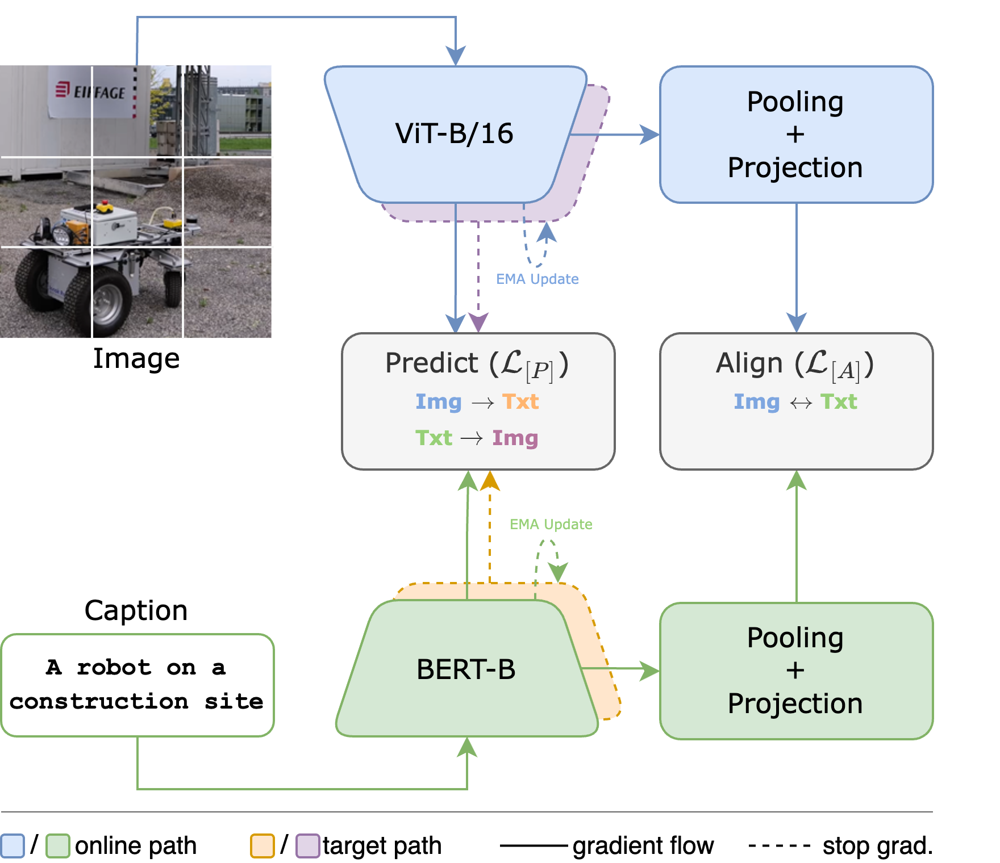
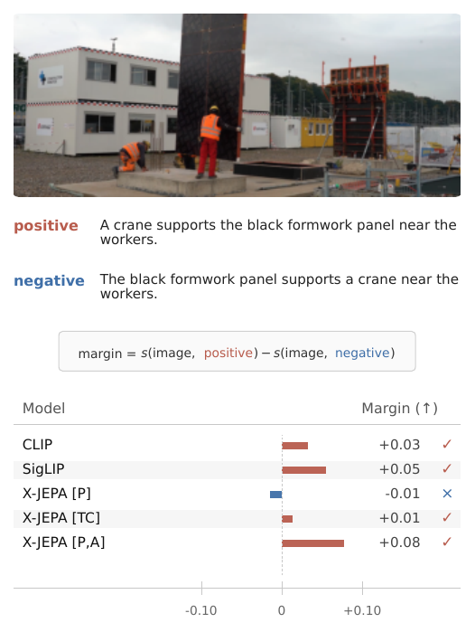
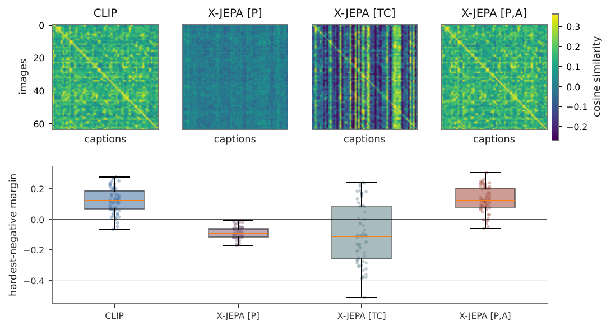

# Latent Prediction Needs Alignment

### A Controlled Study of Joint-Embedding Predictive Vision–Language Learning

[](https://aclanthology.org/)
[](https://huggingface.co/mohkoh/x-jepa)
[](LICENSE)
[](pyproject.toml)

Official code for the paper *Latent Prediction Needs Alignment: A Controlled Study of
Joint-Embedding Predictive Vision–Language Learning* (AACL-IJCNLP 2026).

We ask whether latent cross-modal prediction alone induces the global image–text geometry
needed for zero-shot matching, or whether additional alignment pressure is necessary.
Four objectives are compared under a fully controlled setup — matched backbone, data,
optimization, and evaluation — against matched CLIP and SigLIP baselines:

| Variant | Objective |
|---|---|
| **X-JEPA [P]** | bidirectional latent cross-modal prediction (MSE, EMA targets) |
| **X-JEPA [TC]** | image-to-text target-contrastive prediction (predictor–target InfoNCE) |
| **X-JEPA [P,A]** | latent prediction + direct global alignment, $\mathcal{L}_{[P]} + \lambda\mathcal{L}_{[A]}$ |

Latent prediction retains information that supervised adapters and token-level probes can
recover, but it does not by itself produce a usable pooled cosine geometry. Direct global
alignment supplies the missing constraint: with a modest alignment weight, the predictive
model matches the matched contrastive baselines and improves several language-sensitive
diagnostics.

<p align="center">
  
</p>

Retrieval-oriented alignment is coarse: a model can retrieve a plausible caption
while failing to bind the attribute or relation that distinguishes it from a
hard negative. The figure below shows such a case; the question of this paper is
which objective makes the *global* image–text geometry usable for that
distinction.

<p align="center">
  
</p>

## Results

Main results as reported in the paper (all values in percent; VSR is AUROC).

| Model | COCO ZS MR ↑ | Flickr30k ZS MR ↑ | SugarCrepe++ ↑ | SVO-Probes ↑ | VSR ↑ | NLVR2 token ↑ | NLVR2 global ↑ |
|---|---:|---:|---:|---:|---:|---:|---:|
| CLIP | 67.89 | 79.87 | 71.68 | 84.43 | 63.75 | 54.93 | 57.05 |
| SigLIP | 67.67 | 80.32 | 69.79 | 84.30 | 62.77 | 55.00 | 57.43 |
| X-JEPA [P] | 0.10 | 0.21 | 37.06 | 50.36 | 48.52 | 53.05 | 52.22 |
| X-JEPA [TC] | 44.60 | 48.30 | 44.17 | 80.73 | 57.26 | 56.42 | 51.08 |
| **X-JEPA [P,A] (λ=0.10)** | **69.39** | **81.53** | **73.30** | **85.13** | **63.91** | **60.11** | **58.38** |
| X-JEPA [P,A] (λ=0.30) | 69.47 | 81.66 | 72.59 | 85.19 | 64.58 | 59.67 | 58.32 |
| X-JEPA [P,A] (λ=1.00) | 69.05 | 81.35 | 72.21 | 84.75 | 63.86 | 57.84 | 57.64 |

The pooled image–text geometry behind these numbers is visualized below: CLIP and
X-JEPA [P,A] form a matched-pair diagonal, while X-JEPA [P] has no usable diagonal and
X-JEPA [TC] only partially recovers it.

<p align="center">
  
</p>

## Checkpoints

All eight released checkpoints are hosted at
[`mohkoh/x-jepa`](https://huggingface.co/mohkoh/x-jepa). Each file has a matching
architecture config in [`configs/checkpoints/`](configs/checkpoints), so evaluation does
not require the original training run.

| Checkpoint | Paper model |
|---|---|
| `clip.ckpt` | CLIP |
| `siglip.ckpt` | SigLIP |
| `xjepa_p.ckpt` | X-JEPA [P] |
| `xjepa_tc.ckpt` | X-JEPA [TC] |
| `xjepa_pa_lam003.ckpt` | X-JEPA [P,A] λ=0.03 |
| `xjepa_pa_lam01.ckpt` | X-JEPA [P,A] λ=0.10 |
| `xjepa_pa_lam03.ckpt` | X-JEPA [P,A] λ=0.30 |
| `xjepa_pa_lam10.ckpt` | X-JEPA [P,A] λ=1.00 |

```bash
bash scripts/download_checkpoints.sh        # downloads into ./checkpoints
```

## Setup

The environment is pinned through [`poetry.lock`](poetry.lock) and the
[`Dockerfile`](Dockerfile). Either build the container (recommended for exact
reproducibility) or install the environment directly.

**Container (Apptainer/Singularity)**

```bash
docker build -t x-jepa:latest .
apptainer build x-jepa.sif docker-daemon://x-jepa:latest
```

**Local environment**

```bash
poetry install --with dev          # or: pip install -e . && pip install pytest
pytest -q                          # unit tests, CPU only
```

Every command below is written for the container; drop the
`apptainer exec ./x-jepa.sif` prefix to run the same command in a local
environment.

## Evaluation

Point `ckpt_path` at a released checkpoint and `paths.data_dir` at the dataset root:

```bash
apptainer exec --bind /path/to/data:/data ./x-jepa.sif python src/eval.py \
  experiment=eval/coco_karpathy_zeroshot \
  ckpt_path=checkpoints/xjepa_pa_lam01.ckpt \
  paths.data_dir=/data \
  trainer=gpu
```

The nine evaluations of the paper and their aliases:

| Alias | Paper column | Protocol |
|---|---|---|
| `coco_zeroshot` | COCO ZS MR | zero-shot retrieval, COCO Karpathy test |
| `flickr30k_zeroshot` | Flickr30k ZS MR | zero-shot retrieval |
| `sugarcrepe_pp` | SugarCrepe++ | hard-negative phrase scoring |
| `svo_probes` | SVO-Probes | subject–verb–object role scoring |
| `vsr` | VSR | spatial-relation scoring (AUROC) |
| `coco_adapter_tune` | COCO adapter | frozen backbone, retrieval adapter |
| `flickr30k_adapter_tune` | Flickr30k adapter | frozen backbone, retrieval adapter |
| `nlvr2_token_interaction_probe` | NLVR2 token | frozen token-interaction probe |
| `nlvr2_global_raw_probe` | NLVR2 global | frozen pooled-feature probe |

Run the complete main-results suite for one checkpoint:

```bash
apptainer exec --bind /path/to/data:/data ./x-jepa.sif python scripts/quantitative_eval.py \
  --ckpt-path checkpoints/xjepa_pa_lam01.ckpt \
  --data-dir /data \
  --include paper_core \
  --output-dir results/xjepa_pa_lam01
```

See [`docs/evaluation_suite.md`](docs/evaluation_suite.md) for the per-task protocols,
the data layout, and the checkpoint-selection protocol, and
[`docs/reproduction.md`](docs/reproduction.md) for an end-to-end walkthrough.

## Pretraining

Pretraining uses the cleaned VL4M mixture (CC3M, COCO Captions, SBU Captions, Visual
Genome; 5,029,468 image–text pairs). See [`docs/data_pipeline.md`](docs/data_pipeline.md)
for how the WebDataset shards are built.

```bash
# X-JEPA [P,A] with lambda=0.10, the configuration reported in the main table
apptainer exec --bind /path/to/data:/data ./x-jepa.sif python src/train.py \
  experiment=pretraining/VL4M_xjepa_pa_lam010 \
  paths.data_dir=/data \
  trainer=ddp
```

The matched setups are `pretraining/VL4M_clip`, `VL4M_siglip`, `VL4M_xjepa_p`,
`VL4M_xjepa_tc`, and `VL4M_xjepa_pa_lam{003,010,030,100}`.

`trainer=ddp` describes the 8-GPU node used for the paper.  On other hardware set
`trainer.devices`/`trainer.num_nodes` and `data.batch_size` to your setup: the requested
`effective_batch_size=2048` is what fixes the optimization step, and the runtime derives
`trainer.accumulate_grad_batches` from the values you provide.

Checkpoint selection then uses validation retrieval only:

```bash
apptainer exec --bind /path/to/data:/data ./x-jepa.sif python src/select_checkpoint.py \
  run_dir=logs/VL4M_xjepa_pa_lam010/runs/<timestamp> \
  paths.data_dir=/data
```

## Repository layout

```text
x-jepa/
├── configs/
│   ├── experiment/pretraining/   # the eight matched pretraining runs
│   ├── experiment/eval/          # the nine evaluations of the paper
│   ├── model/                    # model architecture configs
│   └── checkpoints/              # architectures of the released checkpoints
├── docs/                         # data pipeline, evaluation, reproduction
├── scripts/                      # dataset builder, checkpoint download, eval driver
├── src/
│   ├── train.py                  # pretraining entry point
│   ├── eval.py                   # evaluation entry point
│   ├── select_checkpoint.py      # validation-retrieval checkpoint selection
│   ├── data/                     # VL4M and evaluation datamodules, collators
│   ├── evaluation/               # retrieval, adapters, probes, scoring, checkpoint loading
│   ├── models/                   # X-JEPA variants, CLIP/SigLIP baselines
│   └── utils/                    # transforms, schedules, optimizer and runtime helpers
└── tests/                        # CPU unit and integration tests
```

## Citation

```bibtex
@inproceedings{kohankhaki2026latent,
  title     = {Latent Prediction Needs Alignment: A Controlled Study of Joint-Embedding Predictive Vision--Language Learning},
  author    = {Kohankhaki, Mohammad and Kusuma, Daniel and Salehi, Shirin and Kamp, Carsten and Brell-Cokcan, Sigrid and Schmeink, Anke},
  booktitle = {Proceedings of AACL-IJCNLP 2026},
  year      = {2026},
  publisher = {Association for Computational Linguistics},
  note      = {To appear},
}
```

## License

Released under [CC BY-NC 4.0](LICENSE): research and other non-commercial use, with
attribution.  The code in `src/models/components/vision_transformer.py`,
`src/utils/ijepa/` and the schedule helpers derives from the
[I-JEPA](https://github.com/facebookresearch/ijepa) release (Meta Platforms, Inc.),
which is distributed under the same licence; those files keep their upstream copyright
headers.  If you need a permissively licensed build, the affected files have to be
replaced.
